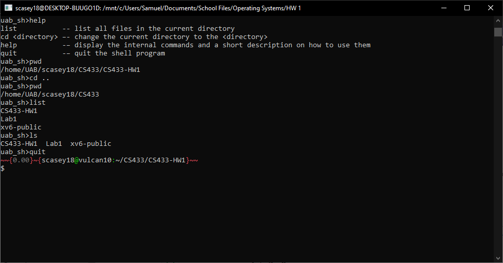
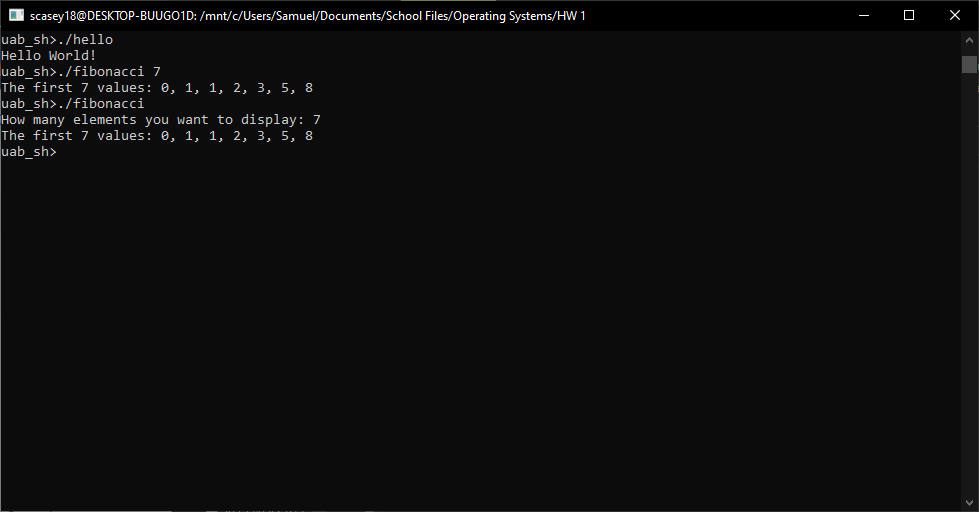
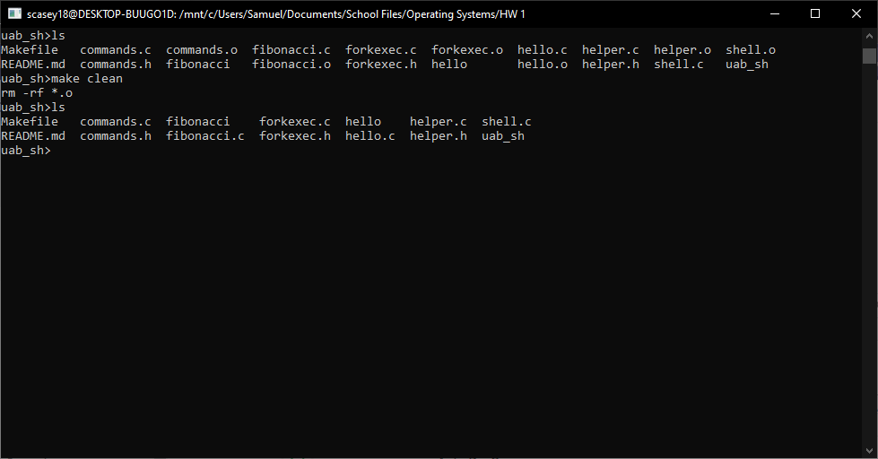

# HW 1

## Project Description
HW 1 assignment in CS433 creating a shell known as uab_sh with starter shell functionality using cd, quit, list, and help

## Author
Samuel Casey

## Acknowledgment
Based on the HW assignment provided by Professor Unan

## Getting Started

### Prerequisites/dependencies
Have the make utility and gcc compiler installed on the device

### Instructions for building the software
1. Clone this repository
2. Open a terminal window at the location of the cloned repository
3. Run the make utility using "make" to make uab_sh, fibonacci, and hello programs in the current file location
4. Run the make utility using "make clean" to remove the extra files

## Running the test
1. Navigate to the location of the compiled "uab_sh" executable
2. Run the program using the command "./uab_sh"

## How to run test cases
Follow Running the Test instructions and then follow the individual commands in each test case

### Sample test cases
1. Open a session using "./uab_sh"
2. Use the "./hello" command then "./fibonacci 7" then "./fibonacci" then input 7 and ensure correct results
3. Use "ls" command then "list" command and compare results
4. Use "pwd" then change to a directory using "cd .." then use "pwd" to ensure results
5. Use the builtin "help" and "quit" commands

## Screenshots/Sample Session

## Contact Information
scasey18@uab.edu